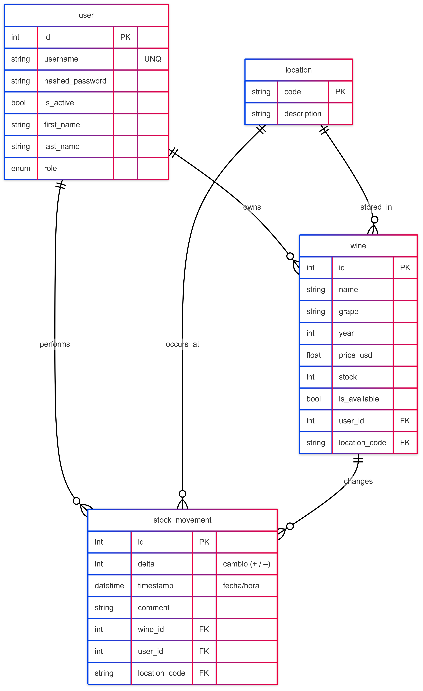
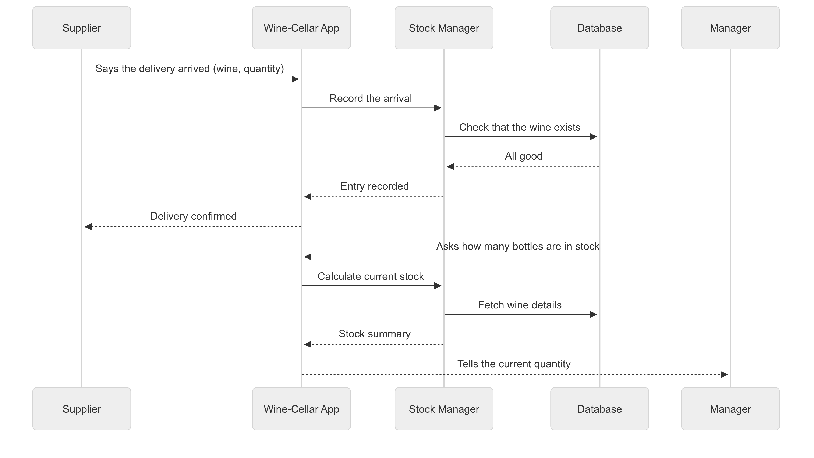

# Wine Cellar Management API  
#### This API was developed to manage a personal or business wine inventory, with support for multiple users and cellar locations.  
---  
### Introduction:  
###### Here is a Mermaid Entities Diagram to understand the domain of the API  
  

---  
#### Entities behaviors to be considered:  

- **USER:** represents the owner or manager of a personal cellar.  
  USER is the only one authenticated and authorized (via JWT).  
  USER can create, update, and manage their own stock of wines.  
  USER can only view and modify wines they own.  
  USER can’t access wines from other users.  

- **WINE:** represents a wine available in a cellar.  
  WINE is uniquely defined by name, vintage, and grape variety.  
  If a wine already exists, users must update the stock rather than duplicate it.  
  WINE is soft-deleted when removed (availability = false).  

- **STOCK_MOVEMENT:** represents the transaction log for wine stock updates.  
  Every movement (addition or subtraction of stock) is recorded with timestamp and quantity.  
  Used to calculate historical inventory data.  

- **LOCATION:** represents physical slots within the cellar (e.g., “A3”, “C1”).  
  WINE can be assigned to one location per user.  
  LOCATION is managed per-user, and can't overlap.  

> #### For a complete list of endpoints and authentication methods visit:  
> [http://127.0.0.1:8000/docs](http://127.0.0.1:8000/docs) for Swagger UI interactive documentation.  

uvicorn app.presentation.main:app --reload for run server.

venv\Scripts\activate for run Virtual env.

---  
### Possible integration with another API:  
> #### The system is ready to sync with external wine catalog APIs (like Vivino or Wine-Searcher) to auto-complete wine metadata, scores, and price indexing.  

  
